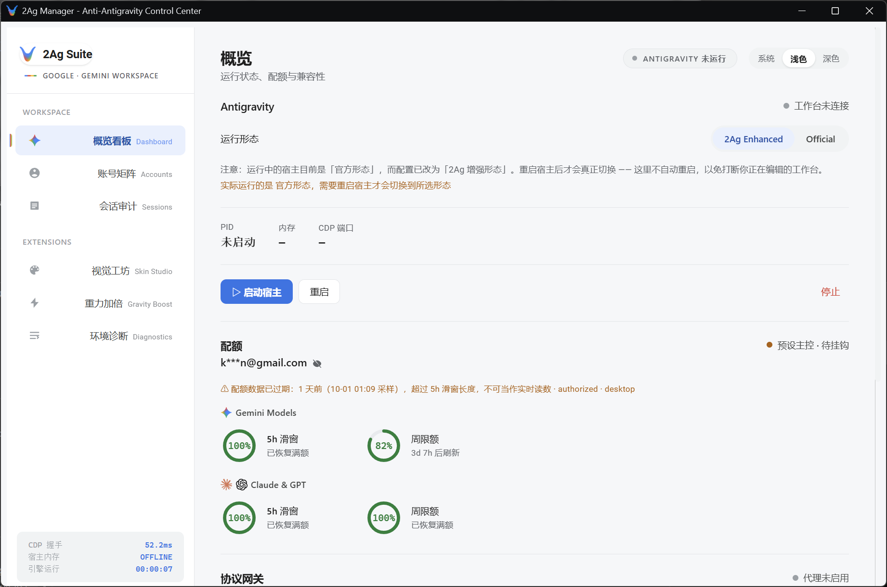
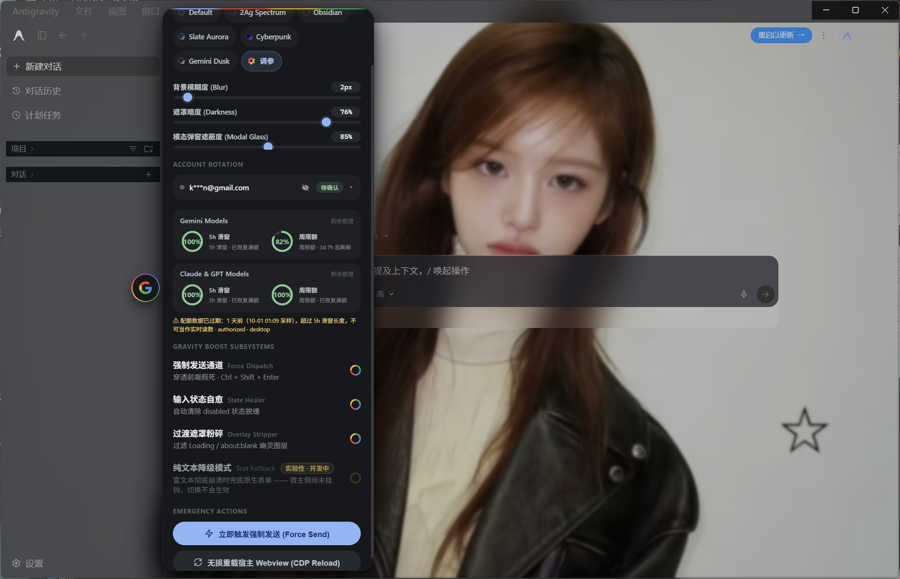
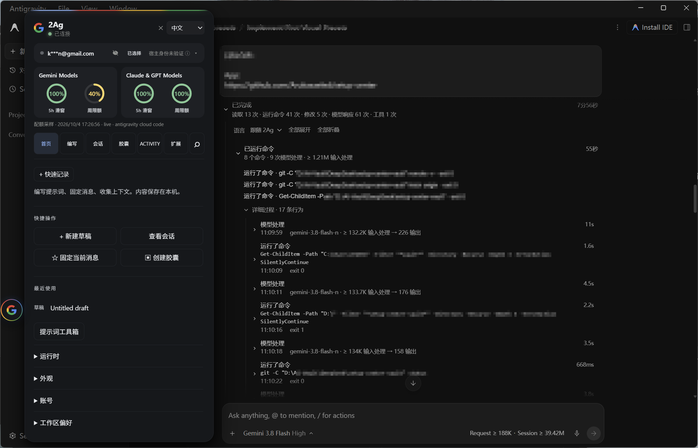
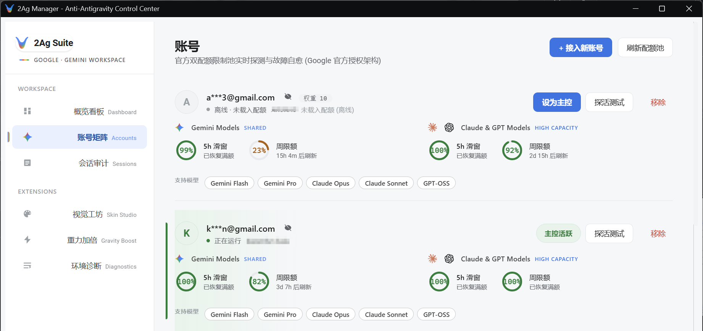
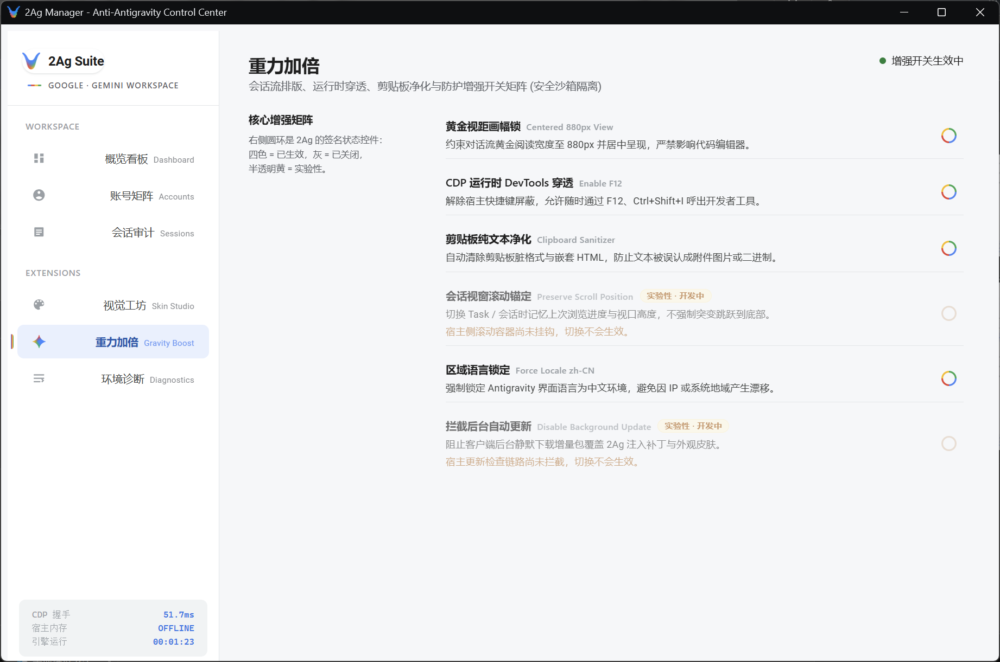
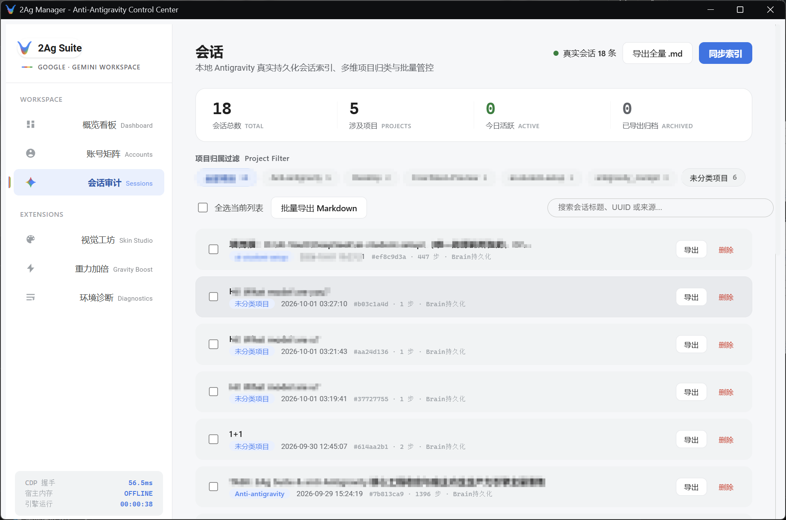

<h1 align="center">2Ag · Anti-Antigravity</h1>

<p align="center">
  <strong>A local desktop enhancement and control layer for Google Antigravity.</strong>
</p>

<p align="center">
  Windows x64 · Local-first · Runtime Injection · No official-file patching
</p>

<p align="center">
  <a href="README.md">简体中文</a> · <strong>English</strong>
</p>

<p align="center">
  <a href="https://github.com/Arukasaeled/Anti-Antigravity/releases/latest"></a>
  <a href="LICENSE"></a>
</p>

<p align="center">
  <strong><a href="https://github.com/Arukasaeled/Anti-Antigravity/releases/latest">Download</a></strong> ·
  <a href="#quick-start">Quick start</a> ·
  <a href="#docs--build">Docs &amp; build</a> ·
  <a href="https://github.com/Arukasaeled/Anti-Antigravity/releases">Release notes</a>
</p>

<p align="center">
  
</p>

2Ag adds **Observe, Control, Manage, and Customize** capabilities to Antigravity. See execution steps and token usage, manage accounts, quotas, and sessions, control how the host runs, and adapt your everyday workspace.

Use **G-Hub inside Antigravity** while working, and the standalone **Manager** for administration. Both serve the same Antigravity environment.

Windows x64 installer and portable ZIP available. Install the official Google Antigravity client first.

## What 2Ag adds

| Capability | What you can do |
|---|---|
| **Observe** | Follow execution phases and tool actions, inspect Request Trace, Context, and Session Tokens, and review past activity. |
| **Control** | Choose Official or Enhanced, control the host lifecycle and runtime switches, and distinguish configured mode, effective mode, and process ownership. |
| **Manage** | View Accounts, Quota, and Antigravity Sessions together; browse installed Skills; inspect Environment, Doctor, and configuration save status. |
| **Customize** | Organize prompts, pinned messages, and Capsules in G-Hub; adjust themes and wallpaper; load local extensions. |

<p align="center">
  
</p>

*Manager brings accounts, quotas, and host status into one place.*

## Inside Antigravity

**G-Hub is the entry point while working; Manager is the entry point for administration.** Runtime injection places G-Hub inside Antigravity, where you can check quotas, open Inspectors, edit prompts, and collect context. Execution enhancements appear in the native conversation Activity area. Request / Session readings sit in the composer control row, following the existing conversation layout and scrolling behavior.

Manager handles accounts, sessions, the local environment, diagnostics, and the host lifecycle. Stay in Antigravity while working; open Manager when you need to manage the environment.

<p align="center">
  
</p>

*G-Hub brings quotas, appearance settings, and workflow tools into Antigravity. This screenshot shows its appearance controls.*

## Execution Observability

2Ag expands compressed official statuses such as `Working...` and `Analyzed...` into an observable execution timeline. File reads, commands, searches, edits, and model responses have individual entries, with durations, line ranges, and command results where the data is available.

| Presentation layer | Purpose |
|---|---|
| **Phase Narrative** | Group real actions into phase summaries, counts, and the current action so you can follow progress. |
| **Detailed ReAct** | Expand Read, Command, Search, Edit, and Model Response entries; consecutive actions of the same type can be grouped and collapsed. |
| **Raw Inspector** | Inspect native identifiers, timestamps, results, and errors. A model response opens its corresponding Request Trace / Token Inspector. |

Entries update as execution progresses. The same step moves from `RUNNING / GENERATING → DONE / ERROR` in place. Runtime supplies the current slice; conversation SQLite supplies persistent history. Native identifiers are used to merge entries while keeping session sources separate.

**Completion collapses the execution record; it does not delete it.** The final answer returns to focus. Expand the record to review it, or rebuild history while the native session data remains available. Expand / collapse all and Chinese / English presentation are supported. Language can follow 2Ag or be set independently. Commands, paths, filenames, code, and raw output / errors remain unchanged.

This is **observable execution**. Phase narratives are based on actual Activity; 2Ag does not read or generate hidden chain-of-thought.

<p align="center">
  
</p>

*2Ag expands compressed Working / Analyzed statuses into a phased execution timeline while keeping access to the underlying actions. This real screenshot shows a completed task expanded for review.*

## Context / Request / Session

Request / Session readings stay in the composer control row, supporting both the centered composer in new sessions and the bottom composer in existing sessions. Hover for a token breakdown from the same data source; click to open the full Inspector.

| Reading | Question it answers |
|---|---|
| **Request** | How much input did this model request process, and how much output did it produce? |
| **Session** | How many tokens has the conversation processed in total, and across how many requests? |
| **Context** | What is the current context usage and limit? Shown when a reliable source is available, with estimates labeled. |

**Request ≠ Session, and Session ≠ Context.** Latest-request readings prioritize native Runtime usage. Session totals prioritize persistent generation data and deduplicate by responseId. Loaded history is shown separately; it does not stand in for the current prompt or Context Window.

Readings preserve provenance and uncertainty. Unknown values show `—`: **unknown ≠ 0**. Native input counts whose category is unresolved appear as **Unclassified Input**, not Cache. Incomplete counts show a `≥` lower bound; estimates are labeled Estimated. Context limits are not guessed from model names, and incomplete cache classification remains `Cache —`.

Request and Session share the same token breakdown. Every token included in Total has a visible category. Reasoning is shown as a subset of Output and is not counted twice. Field definitions, calculations, and source contracts are documented in [OBSERVABILITY.md](docs/OBSERVABILITY.md).

## Accounts & Quota

The local **Account Vault** encrypts credentials with **DPAPI(CurrentUser)**. Import existing official credentials or complete native Google login through the local **Official Login Broker**. 2Ag does not handle Google passwords.

View account quotas for Gemini and Claude / GPT model pools. G-Hub and account views use the same quota source for the selected account: available readings are displayed, unknown values show `—`, and cached readings are labeled.

**selected / applied / verified are reported separately.** Selecting an account, applying its credentials, and verifying the identity inside the running host are different states. Matching the credential owner and checking the write only prove that credentials were applied. Without a reliable host identity source, “Host identity unverified” remains an informational status.

<p align="center">
  
</p>

*Manage accounts and quotas together to see each account's available resources.*

## Sessions / Skills / Environment

- **Sessions Browser**: browse Antigravity sessions by project, inspect Session Tokens, request counts, and Activity history, and delete specific sessions. Message preview and Markdown export require a readable transcript. All operations follow the same resolved store / source.
- **Skills**: browse installed Global / Workspace Skills in read-only mode, including metadata, `SKILL.md`, and resource directories. Installation, enable / disable controls, and a Marketplace are not currently provided.
- **Environment / Doctor / Diagnostics**: inspect installation and storage information, check processes, CDP, injection, Vault, and local data availability, and export diagnostic reports without credentials. Configuration save status distinguishes pending, saved, and save_failed.

| Runtime enhancement switches | Antigravity Sessions |
|---|---|
|  |  |
| Choose runtime enhancements as needed. Experimental options are labeled separately. | Browse, manage, and review local sessions from one entry point. |

## Runtime Control

| Mode | Behavior |
|---|---|
| **Official** | Uses your locally installed official client, without injecting 2Ag UI enhancements. |
| **Enhanced** | Creates a frozen local host copy from your official installation, then uses runtime injection to load G-Hub and conversation enhancements. |

**configured mode** is the setting for the next launch; **effective mode** is what is actually running. Selecting Official / Enhanced only changes configuration. Start, stop, restart, and takeover require explicit user actions. Runtime switches are optional, and their availability depends on the host version.

Processes are classified as `owned` (started and managed by 2Ag), `adopted` (explicitly authorized by the user), or `external` (only discovered). 2Ag does not stop external processes by default. Closing an external instance requires explicit confirmation. Discovering a PID or an Electron single-instance handoff does not grant management rights.

**Official files are not patched.** The Enhanced copy is created locally, is not distributed with 2Ag, and does not automatically follow official updates. See [ARCHITECTURE.md](docs/ARCHITECTURE.md) for the runtime design and lifecycle boundaries.

## Customization & Extensions

G-Hub supports built-in theme presets, your own wallpaper, blur and opacity adjustments, and restoring the default appearance. Theme presets are part of the built-in implementation. The `themes/` directory contains optional reference resources; dropping a file there does not dynamically load a theme.

**Prompt / Capsule workflows** let you save drafts, reuse snippets, pin messages, and collect context. A Capsule combines goals, constraints, and selected content into editable text. Copy it or insert it into Antigravity's composer, then decide when to send.

**Local extensions** can add commands, panels, prompt actions, message actions, and Context Providers, with enable, disable, and reload controls. The repository includes Prompt Toolkit, Conversation Map, and Project Context examples for structuring prompts, navigating loaded messages, and collecting available project context. See [plugins/README.md](plugins/README.md) for the extension contract and [themes/README.md](themes/README.md) for appearance boundaries.

## How it works

```text
Antigravity
├─ React / Runtime + Language Server updates ── CDP ──┐
└─ conversation SQLite ── read-only ─────────────────┤
                                                     ↓
                                                    2Ag
                                                     ├─ G-Hub / inline enhancements
                                                     └─ Manager
```

CDP reads runtime state and injects UI in Enhanced mode. Read-only SQLite access adds persistent history. **No app.asar patch · No official binary modification.** Views share the same data layer. See [Architecture](docs/ARCHITECTURE.md) and [Observability](docs/OBSERVABILITY.md) for details.

## Quick start

1. Use **Windows 10/11 x64 with WebView2** and install the official Google Antigravity client first.
2. Download `Anti-Antigravity-Setup-x64.exe` or `2Ag-v<version>-windows-x64-portable.zip` from the **[latest Release](https://github.com/Arukasaeled/Anti-Antigravity/releases/latest)**.
3. Run the installer, or extract the entire portable ZIP with its `assets/`, `themes/`, and `plugins/` directories intact. Launch `2ag.exe`.
4. Select Official / Enhanced and click **Start host** when ready. **The first Enhanced launch creates a local host copy from your official installation.** Time and disk space depend on the installed version.

## Privacy / Security

Local-first, with no author-operated telemetry server. Account login and quota requests still use official services. The local Control API validates a random control token and rejects untrusted Origins. Process ownership protects external instances. The proxy does not install a CA or perform TLS MITM.

Activity / Request details and local extensions involve user content. Review paths, commands, and raw output before sharing. See [SECURITY.md](docs/SECURITY.md) for credential protection, extension permissions, and network boundaries.

## Known limits

- Currently supports Windows x64. You must provide your own official Antigravity installation.
- Native fields and React structures depend on the host version. Missing readings remain Unavailable; unknown tools remain Tool.
- Historical review requires the native session data to remain available. Unloaded, unparseable, or truncated content cannot be fully reconstructed. Available SQLite Activity / Token data does not imply message preview or export is available.
- Token classification, Cache, and Context limits may be unknown. A reliable identity source inside the host is not currently available. Profile isolation does not isolate the shared system credential.
- Updating the frozen host from the official installation is a user choice. Some runtime switches depend on the host version.

## Docs & Build

[Architecture](docs/ARCHITECTURE.md) · [Observability](docs/OBSERVABILITY.md) · [Security](docs/SECURITY.md) · [Configuration](docs/CONFIGURATION.md) · [CLI](docs/CLI.md)

See [BUILD.md](docs/BUILD.md) for source builds and release packaging, and [DEVELOPMENT.md](docs/DEVELOPMENT.md) for development notes. Local extension and theme references are in [plugins/README.md](plugins/README.md) and [themes/README.md](themes/README.md). Version-specific changes belong in [Release notes](https://github.com/Arukasaeled/Anti-Antigravity/releases).

The linked technical documents are currently in Simplified Chinese.

## Credits / Trademark

- Google Antigravity provides the host. Chromium DevTools Protocol and [go-webview2](https://github.com/jchv/go-webview2) provide the injection and window foundations.
- [Cockpit Tools](https://github.com/jlcodes99/cockpit-tools) (CC-BY-NC-SA-4.0) informed quota protocol behavior; 2Ag did not copy its code. [Token Monitor](https://github.com/Javis603/token-monitor) / [Tokscale](https://github.com/Javis603/tokscale) informed the Antigravity native usage, deduplication, and aggregation design.
- Material Design / Gemini informed the visual design. Other community design references are listed in [OBSERVABILITY.md](docs/OBSERVABILITY.md).

2Ag's own code and documentation are licensed under [Apache License 2.0](LICENSE). Google Antigravity runtime files are not included or distributed. Google, Antigravity, Gemini, Claude, ChatGPT, and other names and marks belong to their respective owners. 2Ag is not officially affiliated with or endorsed by Google, Anthropic, or OpenAI.
